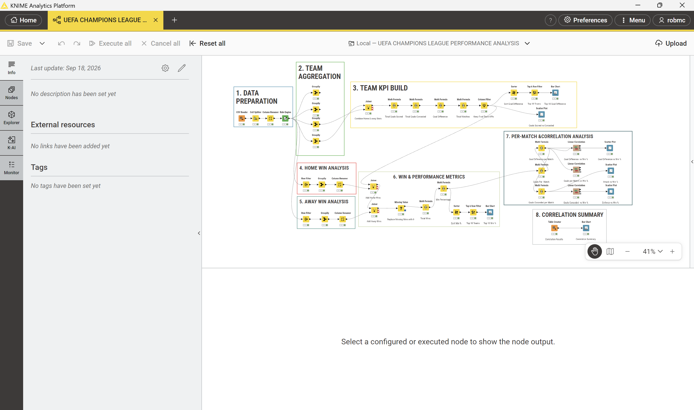
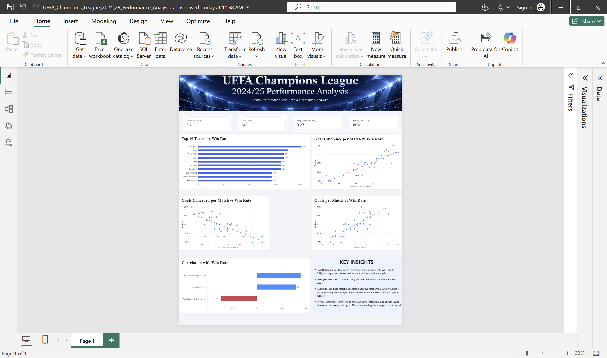

# UEFA Champions League 2024/25 Performance Analysis

An end-to-end football data analytics project using **KNIME** for data preparation and statistical analysis and **Power BI** for data modelling, KPI development and interactive visualisation.

The project analyses UEFA Champions League 2024/25 match results to explore which team performance metrics are most strongly associated with winning.

---

## Project Objective

The objective was to transform match-level Champions League data into a team-level performance dataset and investigate the relationship between:

- Goals scored
- Goals conceded
- Goal difference
- Win rate
- Goals per match
- Goal difference per match
- Goals conceded per match

The final analysis identifies the performance indicators most strongly associated with team success.

---

## Tools Used

**KNIME Analytics Platform**
- Data cleaning and preparation
- Column transformation
- Data aggregation
- Table joins
- KPI calculation
- Rule-based transformations
- Correlation analysis

**Microsoft Power BI**
- Data modelling
- DAX measures
- KPI cards
- Ranking analysis
- Scatter plots
- Trend lines
- Correlation visualisation
- Dashboard design

---

## Dataset

The project uses UEFA Champions League 2024/25 match results.

Source: FixtureDownload

The original match-level dataset contained information including:

- Match number
- Round
- Date
- Location
- Home team
- Away team
- Match result

The data was transformed into a team-level analytical dataset containing **36 teams**.

---

## Data Preparation in KNIME

The workflow was developed in several stages:

1. Import match data using CSV Reader
2. Split match scores into individual goal columns
3. Rename and standardise fields
4. Create match-result classifications using Rule Engine
5. Aggregate home and away team statistics
6. Join team-level tables
7. Calculate total goals scored and conceded
8. Calculate goal difference and total matches
9. Calculate home wins and away wins
10. Build overall win-rate metrics
11. Calculate per-match performance indicators
12. Perform correlation analysis
13. Export the final analytical dataset for Power BI

---

## KNIME Workflow

The KNIME workflow demonstrates the complete transformation from raw match results to team-level performance metrics.



---

## Key Performance Indicators

The final Power BI dashboard contains four headline KPIs:

| KPI | Result |
|---|---:|
| Teams Analysed | 36 |
| Total Goals | 618 |
| Average Goals per Match | 3.27 |
| Highest Team Win Rate | 80% |

---

## Power BI Dashboard

The dashboard combines team rankings, performance metrics and statistical relationships into a single analytical view.



---

## Correlation Analysis

Three team performance indicators were compared with win rate.

| Performance Metric | Correlation with Win Rate |
|---|---:|
| Goal Difference per Match | **0.89** |
| Goals per Match | **0.80** |
| Goals Conceded per Match | **-0.73** |

### Key Findings

**Goal Difference per Match** showed the strongest association with Win Rate (**r = 0.89**), making it the clearest performance indicator in this analysis.

**Goals per Match** also demonstrated a strong positive relationship with Win Rate (**r = 0.80**).

**Goals Conceded per Match** showed a strong negative relationship with Win Rate (**r = -0.73**), indicating that teams conceding fewer goals per match generally achieved stronger win rates.

Overall, successful teams tended to combine **higher attacking output with lower defensive concession**, with goal difference providing the strongest overall performance signal.

---

## Power BI Measures

One of the measures created in Power BI calculated the overall competition average goals per match:

```DAX
Average Goals per Match =
DIVIDE(
    SUM('UEFA_Champions_League_Project_Team_Performance'[Total Goals Scored]) * 2,
    SUM('UEFA_Champions_League_Project_Team_Performance'[Total Matches])
)

uefa-champions-league-performance-analysis/
│
├── data/
│   └── UEFA_Champions_League_Project_Team_Performance.csv
│
├── images/
│   ├── powerbi-dashboard.png
│   └── knime-workflow.png
│
├── knime/
│   └── UEFA_Champions_League_Performance_Analysis.knwf
│
├── powerbi/
│   └── UEFA_Champions_League_2024_25_Performance_Analysis.pbix
│
└── README.md

Analytical Limitations
The analysis focuses on match-result and goal-based performance data.
It does not currently include additional football metrics such as:
- Expected Goals (xG)
- Possession
- Shots and shots on target
- Opposition strength
- Player-level performance
- Tactical formations
The correlations identified in this project represent statistical associations and should not be interpreted as proof of causation.
Future Development
Future versions of the project could include:
- Multi-season Champions League analysis
- Expected Goals and advanced match statistics
- Team clustering and segmentation
- Predictive modelling
- Regression analysis
- Home vs away performance comparison
- Interactive team filtering in Power BI
- Player-level analysis
Skills Demonstrated
Data Preparation | Data Cleaning | Data Transformation | Data Aggregation | Data Modelling | KPI Development | DAX | Statistical Analysis | Correlation Analysis | Data Visualisation | Dashboard Design | KNIME | Power BI
